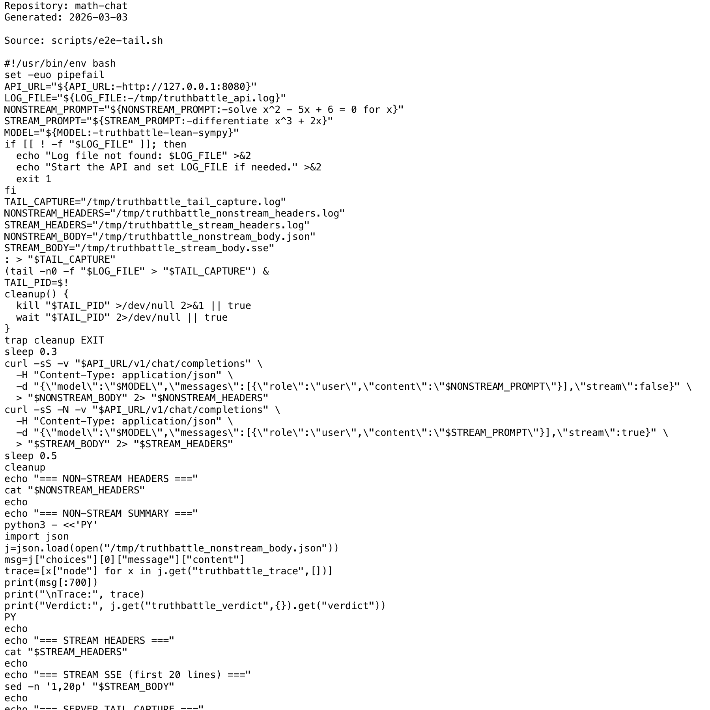

# Project Narrative & Proof

Generated: 2026-03-03

## User Journey
1. Discover the project value in the repository overview and launch instructions.
2. Run or open the build artifact for math-chat and interact with the primary experience.
3. Observe output/behavior through the documented flow and visual/code evidence below.
4. Reuse or extend the project by following the repository structure and stack notes.

## Design Methodology
- Iterative implementation with working increments preserved in Git history.
- Show-don't-tell documentation style: direct assets and source excerpts instead of abstract claims.
- Traceability from concept to implementation through concrete files and modules.

## Progress
- Latest commit: 4d91b5d (2026-02-21) - add DSPy fallback engine and smart pipeline routing
- Total commits: 17
- Current status: repository has baseline narrative + proof documentation and CI doc validation.

## Tech Stack
- Detected stack: Python, GitHub Actions

## Main Key Concepts
- Key module area: `.agent`
- Key module area: `.claude`
- Key module area: `openspec`
- Key module area: `scripts`
- Key module area: `src`
- Key module area: `tests`

## What I'm Bringing to the Table
- End-to-end ownership: from concept framing to implementation and quality gates.
- Engineering rigor: repeatable workflows, versioned progress, and implementation-first evidence.
- Product clarity: user-centered framing with explicit journey and value articulation.

## Show Don't Tell: Screenshots


## Show Don't Tell: Code Excerpt
Source: `scripts/e2e-tail.sh`

```bash
#!/usr/bin/env bash
set -euo pipefail
API_URL="${API_URL:-http://127.0.0.1:8080}"
LOG_FILE="${LOG_FILE:-/tmp/truthbattle_api.log}"
NONSTREAM_PROMPT="${NONSTREAM_PROMPT:-solve x^2 - 5x + 6 = 0 for x}"
STREAM_PROMPT="${STREAM_PROMPT:-differentiate x^3 + 2x}"
MODEL="${MODEL:-truthbattle-lean-sympy}"
if [[ ! -f "$LOG_FILE" ]]; then
  echo "Log file not found: $LOG_FILE" >&2
  echo "Start the API and set LOG_FILE if needed." >&2
  exit 1
fi
TAIL_CAPTURE="/tmp/truthbattle_tail_capture.log"
NONSTREAM_HEADERS="/tmp/truthbattle_nonstream_headers.log"
STREAM_HEADERS="/tmp/truthbattle_stream_headers.log"
NONSTREAM_BODY="/tmp/truthbattle_nonstream_body.json"
STREAM_BODY="/tmp/truthbattle_stream_body.sse"
: > "$TAIL_CAPTURE"
(tail -n0 -f "$LOG_FILE" > "$TAIL_CAPTURE") &
TAIL_PID=$!
cleanup() {
  kill "$TAIL_PID" >/dev/null 2>&1 || true
  wait "$TAIL_PID" 2>/dev/null || true
}
trap cleanup EXIT
sleep 0.3
curl -sS -v "$API_URL/v1/chat/completions" \
  -H "Content-Type: application/json" \
  -d "{\"model\":\"$MODEL\",\"messages\":[{\"role\":\"user\",\"content\":\"$NONSTREAM_PROMPT\"}],\"stream\":false}" \
  > "$NONSTREAM_BODY" 2> "$NONSTREAM_HEADERS"
curl -sS -N -v "$API_URL/v1/chat/completions" \
  -H "Content-Type: application/json" \
  -d "{\"model\":\"$MODEL\",\"messages\":[{\"role\":\"user\",\"content\":\"$STREAM_PROMPT\"}],\"stream\":true}" \
  > "$STREAM_BODY" 2> "$STREAM_HEADERS"
sleep 0.5
```
